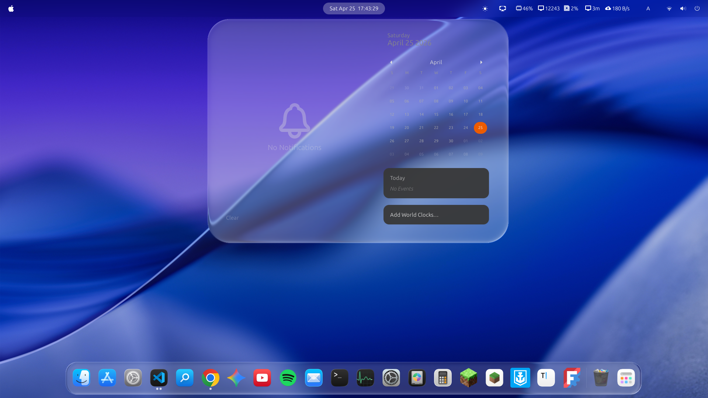

# Liquid Glass for GNOME Shell


A GNOME Shell Extension that brings Apple's "Liquid Glass" UI (introduced in iOS 26 / macOS Tahoe) to your Linux desktop.

I love the look of Apple's Liquid Glass, but since I don't own any Apple products (I use an Android smartphone and a Linux computer), I wanted a way to see it on my desktop every day. So, I decided to build it myself.

### 🎥 Demo
<video src="desktop.mp4" autoplay loop muted width="100%"></video>




## 🚀 Installation (GNOME Extension)

Currently, this extension targets the **Top Panel Menus** and **Dock**.

### Option 1: Quick Install (Terminal)
Copy and paste this one-liner to clone and install it immediately:

```bash
git clone https://github.com/ryohsuke1231/liquid-glass.git && \
mkdir -p ~/.local/share/gnome-shell/extensions/ && \
cp -r liquid-glass/liquid-glass@thinkingcoding1231.gmail.com ~/.local/share/gnome-shell/extensions/
```

### Option 2: Manual Install
1. Clone this repository: `git clone https://github.com/ryohsuke1231/liquid-glass.git`
2. Open the `liquid-glass` folder.
3. Copy the **entire `liquid-glass@thinkingcoding1231.gmail.com` folder** to:
   `~/.local/share/gnome-shell/extensions/`
4. **Restart GNOME Shell**:
   - **Wayland**: Log out and log back in.
   - **X11**: Press `Alt` + `F2`, type `r`, and hit `Enter`.
5. Enable **Liquid Glass** in the "Extensions" app or Extension Manager.


## ✨ Under the Hood: Shader Processing & Optical Effects

This is not just a blurred background. I built a custom `Clutter.ShaderEffect` to simulate physically-based light refraction and fluid-like surface tension.

* **Refraction via Snell's Law**: Calculates realistic light bending using the Index of Refraction (IOR). It projects the refracted view vector onto the background plane to determine spatial displacement.
* **Volume Profiling**: Computes interior depth using **Superellipse** cross-section formulas, allowing the capsule to simulate fluid-like thickness (`max_z`) and smooth height falloffs toward the edges.
* **Chromatic Aberration**: Displaces RGB color channels independently based on the refraction direction, simulating prismatic effects at the edges of the volume.
* **Adaptive Anti-Aliasing (Pseudo-MSAA)**: Implements dynamic multi-tap sampling. It adjusts the sampling radius based on the steepness of the surface normal, smoothing out jaggies caused by steep texture displacement.
* **Complex Lighting Model**: Combines directional rim lighting with fresnel falloff, specular highlights, and surface sheen matched to 3D surface normals rather than flat 2D gradients.
* **Custom Spring Physics**: Bypasses standard CSS transitions to implement a custom physics-based Spring animation system for opening/closing menus, mimicking the natural, snappy feel of native UI.


## 📖 The Story Behind the Math
Recreating the perfect "glass" look was a journey of trial and error. 

Initially, I tried using a raw SDF (Signed Distance Field) directly as the height map, but it resulted in a "hipped roof" shape with sharp ridges. I then tried combining straight lines and circular arcs, but the sudden change in curvature caused unnatural, sharp distortions in the light refraction. 

The breakthrough was implementing a **Superellipse** and properly defining the normal vectors (displacement field). This finally solved the distortion issues and gave the UI that perfect, melting surface tension.


## 🧪 The WebGL/Three.js Prototype (The Lab)

Before writing the GNOME implementation in GJS/Clutter, I built a standalone WebGL prototype using Three.js to perfect the math, shaders, and real-time tuning. 


You can run the web prototype locally:
```bash
cd prototype
npm install
npm run dev
```


## 🗺️ Roadmap
- [x] Perfect the WebGL/Three.js Prototype
- [x] Port GLSL shaders to GNOME Shell (`Clutter.ShaderEffect` / GJS)
- [x] Apply Liquid Glass to Top Panel Menus
- [x] Add Dash to Dock support
- [x] Add Notifications support
- [ ] Add Settings Feature
- [ ] Publish to extensions.gnome.org