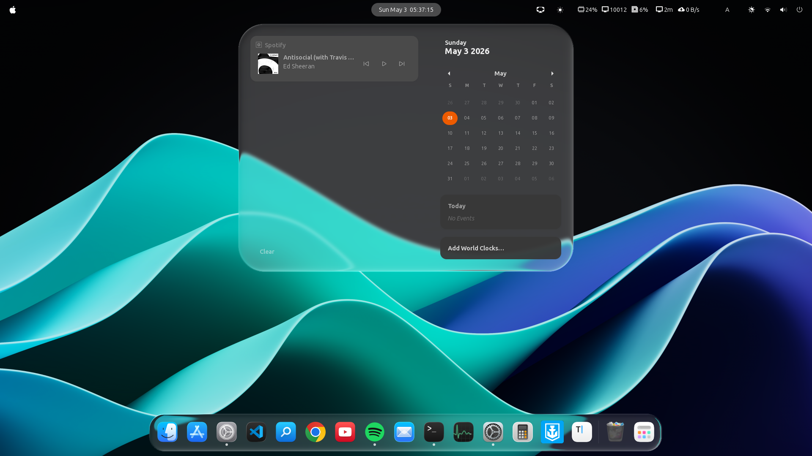
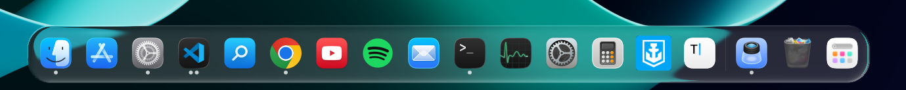
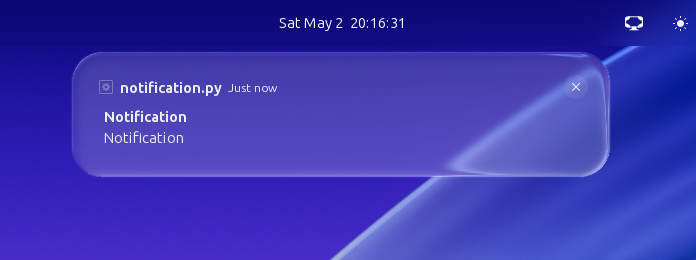
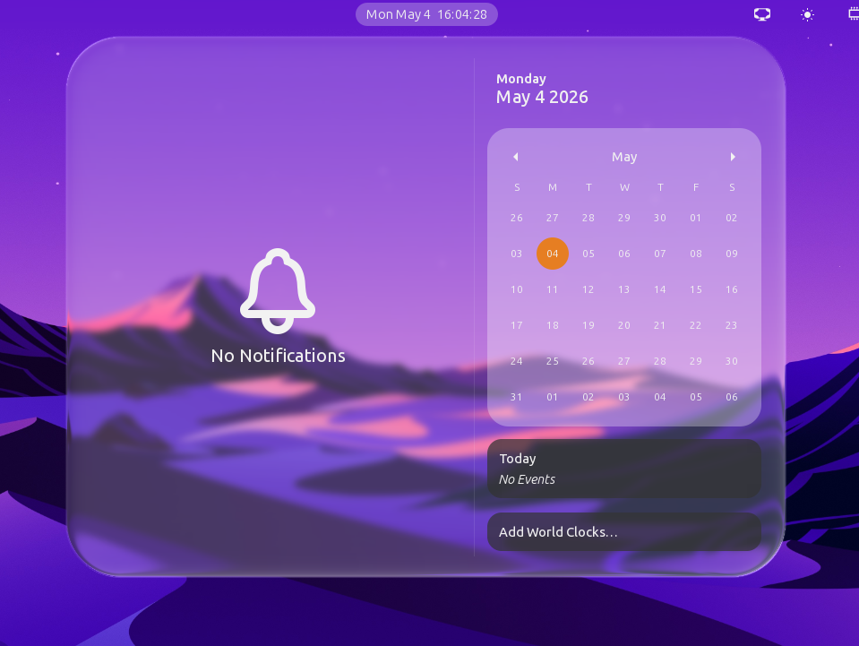
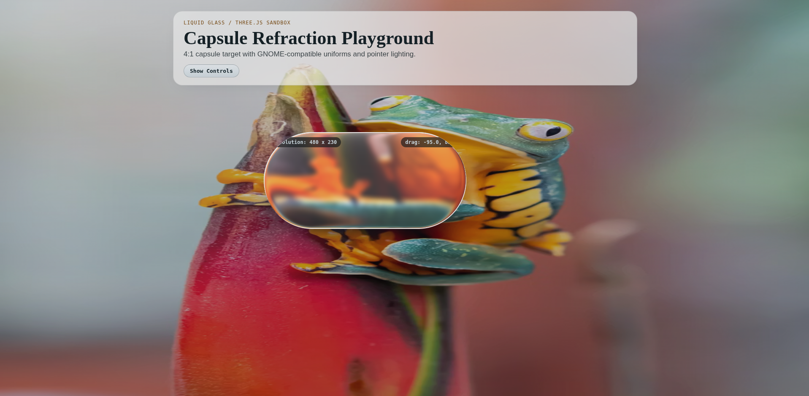

# Liquid Glass for GNOME Shell


A GNOME Shell Extension that brings Apple's "Liquid Glass" UI (introduced in iOS 26 / macOS Tahoe) to your Linux desktop.

I love the look of Apple's Liquid Glass, but since I don't own any Apple products (I use an Android smartphone and a Linux computer), I wanted a way to see it on my desktop every day. So, I decided to build it myself.

### Demo
Overview:

Dash to Dock:

Notifications:

Panel Menus:



## Installation (GNOME Extension)

Currently, this extension targets the **Top Panel Menus** and **Dock**.

### Option 1: Quick Install (Terminal)
Copy and paste this one-liner to clone and install it immediately:

```bash
git clone https://github.com/ryohsuke1231/liquid-glass.git && \
mkdir -p ~/.local/share/gnome-shell/extensions/ && \
cp -r liquid-glass/liquid-glass@thinkingcoding1231.gmail.com ~/.local/share/gnome-shell/extensions/
```

### Option 2: Manual Install
1. Clone this repository: `git clone https://github.com/ryohsuke1231/liquid-glass.git`
2. Open the `liquid-glass` folder.
3. Copy the **entire `liquid-glass@thinkingcoding1231.gmail.com` folder** to:
   `~/.local/share/gnome-shell/extensions/`
4. **Restart GNOME Shell**:
   - **Wayland**: Log out and log back in.
   - **X11**: Press `Alt` + `F2`, type `r`, and hit `Enter`.
5. Enable **Liquid Glass** in the "Extensions" app or Extension Manager.


## Under the Hood: Shader Processing & Optical Effects

This is not just a blurred background. I built a custom `Clutter.ShaderEffect` to simulate physically-based light refraction and fluid-like surface tension.

- **Refraction via Snell's Law**: Calculates realistic light bending using the Index of Refraction (IOR). It projects the refracted view vector onto the background plane to determine spatial displacement.
- **Volume Profiling**: Computes interior depth using **Superellipse** cross-section formulas, allowing the capsule to simulate fluid-like thickness and smooth height falloffs toward the edges.
- **Complex Lighting Model**: Combines directional rim lighting with fresnel falloff, specular highlights, and surface sheen matched to 3D surface normals rather than flat 2D gradients.
- **Custom Spring Physics**: Bypasses standard CSS transitions to implement a custom physics-based Spring animation system for opening/closing menus, mimicking the natural, snappy feel of native UI. (Only for panel menus for now.)
- **Adaptive Text Coloring**: Dynamically adjusts text color based on the underlying background brightness to maintain readability while preserving the glassy aesthetic.


## 📖 The Story Behind the Math
Recreating the perfect "glass" look was a journey of trial and error. 
I started with simple Gaussian blur and opacity tweaks, but it looked flat and lifeless. To capture the depth and fluidity of real glass, I had to dive deep into optics and geometry.
I started by building a prototype in WebGL/Three.js to perfect the math and real-time tuning before porting it to GJS/Clutter. I had to implement Snell's Law for refraction, superellipse formulas for volume profiling, and a custom lighting model that combined rim lighting with fresnel falloff and specular highlights.

Capturing the background of the menu and applying the shader effect to it was another challenge. I had to figure out how to sample the background texture and apply the shader effect in real-time as the menu opened and closed.
In Wayland, I wasn't able to capture the background texture directly, so I had to use `Clutter.Clone` to create a live clone of the background and apply the shader effect to it.

I lost count of how many times I crashed GNOME Shell during development.


## 🧪 The WebGL/Three.js Prototype (The Lab)

Before writing the GNOME implementation in GJS/Clutter, I built a standalone WebGL prototype using Three.js to perfect the math, shaders, and real-time tuning. 



You can run the web prototype locally:
```bash
cd prototype
npm install
npm run dev
```


## 🗺️ Roadmap
- [x] Perfect the WebGL/Three.js Prototype
- [x] Port GLSL shaders to GNOME Shell (`Clutter.ShaderEffect` / GJS)
- [x] Apply Liquid Glass to Top Panel Menus
- [x] Add Dash to Dock support
- [x] Add Notifications support
- [x] Add Settings Feature
- [x] Add Adaptive Text Coloring
- [ ] Add Quick Settings Support
- [ ] Add Perfect Antialiasing
- [ ] Publish to extensions.gnome.org