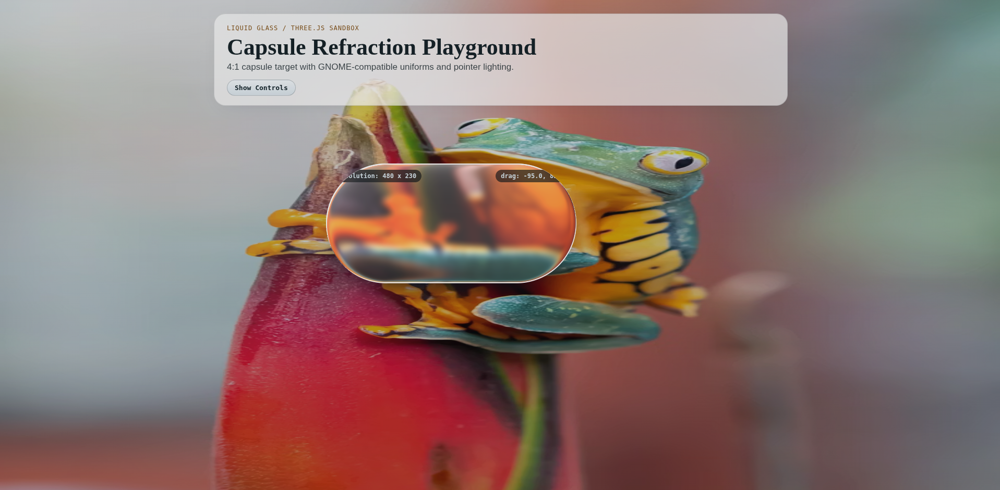

# Liquid Glass for GNOME Shell


A GNOME Shell Extension that replicates the "Liquid Glass" UI concept using shaders on your desktop.

> [!NOTE]
> **Disclaimer:** This is an unofficial, community-driven fan project and is not affiliated with, endorsed by, or connected to Apple Inc. in any way.

I love the look of Apple's Liquid Glass, but since I don't own any Apple products (I use an Android smartphone and a Linux computer), I wanted a way to see it on my desktop every day. So, I decided to build it myself.

> **Are you a developer?** If you'd like to use this glass effect in your own GTK 4 / libadwaita app, take a look at [glass-lib](https://github.com/ryohsuke1231/glass-lib).

## Demo

> Unless noted otherwise, the screenshots below use the [MacTahoe GTK theme](https://github.com/vinceliuice/MacTahoe-gtk-theme) (Dark) by vinceliuice. The theme is not bundled with this extension and has to be installed separately.
>
> If you like the macOS-ish look, give MacTahoe a try. It pairs really nicely with the glass, and it's what I use every day.


Dash to Dock:


Notifications:


Panel Menus:


Top Bar Menu:


> The menu in this screenshot comes from the [Kiwi Menu](https://github.com/kem-a/kiwi-menu) extension by kem-a. Liquid Glass only provides the glass.

Desktop Menu:


Quick Settings (Background mode, Adwaita theme):


Quick Settings (Toggle mode, Adwaita theme):


Quick Settings (Toggle mode, MacTahoe theme):


Application Windows:


OSD:


## Installation (GNOME Extension)

Liquid Glass supports **GNOME Shell 46 to 51** (for example Ubuntu 24.04 LTS, Debian 13 and current Fedora releases). It is developed and used daily on GNOME 50; the other versions are tested in containers.

> [!IMPORTANT]
> This extension is **not yet available on [extensions.gnome.org](https://extensions.gnome.org)**. It has been submitted, but is still unreviewed, so for now it has to be installed manually using one of the methods below.

### Option 1: Quick Install (Terminal)
Copy and paste this one-liner to clone and install it immediately:

```bash
git clone https://github.com/ryohsuke1231/liquid-glass.git && \
mkdir -p ~/.local/share/gnome-shell/extensions/ && \
cp -r liquid-glass/liquid-glass@thinkingcoding1231.gmail.com ~/.local/share/gnome-shell/extensions/
```

### Option 2: Manual Install
1. Clone this repository: `git clone https://github.com/ryohsuke1231/liquid-glass.git`
2. Open the `liquid-glass` folder.
3. Copy the **entire `liquid-glass@thinkingcoding1231.gmail.com` folder** to:
   `~/.local/share/gnome-shell/extensions/`
4. **Restart GNOME Shell**:
   - **Wayland**: Log out and log back in.
   - **X11**: Press `Alt` + `F2`, type `r`, and hit `Enter`.
5. Enable **Liquid Glass** in the "Extensions" app or Extension Manager.


## What Can Be Made of Glass

The effect can be enabled or disabled per UI element on the **Effects** page. In the **Simple** view every element shares one look (blur, corners, tint); switch the view to **Advanced** (Appearance → Settings) to tune each element on its own — tint color and strength, blur radius, corner radius, glass expand, offsets, and brightness / contrast / saturation — plus the element-specific features listed below. Values you tune by eye have a slider next to the number; values whose number is what matters (spring constants, intervals) are typed in.

| Element | Notes / Special features |
| --- | --- |
| **Top Bar** | The bar itself, as **one pill** across the screen or **three pills** behind its groups of buttons (activities, clock, status icons), chosen on the Effects page (Appearance → Top bar in the Advanced view). The space around the pills (**margin**) and between their edges and the buttons (**padding**) can be set per side in the Advanced view; the bar grows to make room, and maximized windows stay below it. Off by default. Supports **adaptive text coloring**. |
| **Dash to Dock** | Glass behind the dock. Adds a bottom margin control so the dock can float above the screen edge. Works with the Dash to Dock / Ubuntu Dock extension. |
| **Calendar & Other Top Bar Menus** | Glass behind the calendar (clock) menu and behind the menus of the other top bar indicators — the keyboard layout and accessibility menus, and the indicators other extensions add, including [ArcMenu](https://gitlab.com/arcmenu/ArcMenu)'s menu and its right-click menu. Each detected menu can be switched off on its own. Menus **grow out of their button**, after [liquid-dom](https://github.com/AndrewPrifer/liquid-dom)'s menu demo: the button's highlight drops out of the button and rounds off into a drop of glass, which is thrown out to where the menu will be — each time with a small push in a random downward direction — and swells into the menu, its items coming up through the glass, seen bent by its rim at first. Closing runs it back: the menu shrinks into a drop that rises into the button, widening into its highlight on the way, and fades once it has become the highlight. Off by default (Appearance → Behavior → "Menus grow from their button"). With that off, a **custom spring animation** (stiffness / damping / mass) scales the menu instead. Also supports **adaptive text coloring**. |
| **Notifications** | Glass behind notification banners. Supports **adaptive text coloring** and a hide safety margin to avoid flicker while the banner is dismissed. |
| **Quick Settings** | Two modes: **Whole menu** applies one sheet of glass behind the whole panel, and **Individual buttons** turns every toggle button into its own piece of glass, keeping each toggle's own accent color (see "Button base color"). Also supports spring animation and adaptive text coloring. |
| **OSD** | Glass behind the on-screen displays (volume, brightness, and so on), with adaptive text coloring. |
| **Application Windows** | Glass behind application windows, with a **window content opacity** slider so the glass shows through the window itself. Applies either to selected applications, or to all windows minus exclusions. Both lists are filled from a live picker of your currently open windows, so there is no need to look up `WM_CLASS` values by hand. |

### Adaptive Text Coloring

Where it is supported, the extension samples the brightness of what is behind the UI and adjusts the text color so labels stay readable on both bright and dark wallpapers. A **Preferred text color** (Automatic / Light / Dark) decides the cases where the background favors neither. The sample interval is configurable; a shorter interval reacts faster but costs more CPU.

### Quick Settings: Whole menu vs. Individual buttons

- **Whole menu** applies the glass as one continuous sheet behind the whole quick settings panel. Corner radius, X/Y offset and the spring animation apply to that sheet.
- **Individual buttons** gives each toggle button its own glass shape, tracked individually. "Button corners" sets the roundness of each shape, and "Button base color" controls how much of the toggle's own original color (for example the blue of an active toggle) is kept, independently of the custom tint color.


### Using it with Blur my Shell

Recent versions of [Blur my Shell](https://github.com/aunetx/blur-my-shell) (74) blur popup menus, notifications and OSDs by default. Its blur shows through the glass, so turn off **Popups** in Blur my Shell. While Blur my Shell's popup blur is on, the Liquid Glass preferences show a warning at the top of the Appearance page with a button that turns it off, and the extension notes it in its log when Logging is on. Turning off Popups leaves Blur my Shell's other effects on.

## On the Desktop

The **Desktop** page of the preferences adds glass that is not part of GNOME's own interface. All three are off by default.

### Glass Clock

A large clock whose digits are themselves glass, like the clock on the iPhone's lock screen, with the date above it. It sits on the desktop below the windows. Pick a place for it (one of the four corners or the center) in the preferences or from its right-click menu (**Position**), or right-click it and choose **Move and Resize**: a frame appears round it, to drag it anywhere and to resize it by the handles. The side handles make the digits wider; the top and bottom ones make them taller the way the iPhone's tall clock does, in one of two ways (**Taller digits** in the preferences): **evenly**, the default, or **along their upright strokes**, lengthening the straight upright parts while curves and bars keep their shape and the parts above and below a join in the middle (of a 3, 5 or 8) grow alike. Either way every stroke keeps its width whichever way it runs, corners stay sharp and the colon's dots keep their shape; the corners scale the whole clock. It stays where it was moved until you pick a place again. The font, the size, the width, the height, the time format (as in Settings, 24-hour or 12-hour), the date, the blur and the tint can be changed. Four condensed fonts that suit a tall clock come with the extension, each in Light, Regular, SemiBold and Bold: [Antonio](https://fonts.google.com/specimen/Antonio), [Barlow Condensed](https://fonts.google.com/specimen/Barlow+Condensed), [Saira Extra Condensed](https://fonts.google.com/specimen/Saira+Extra+Condensed) and [Sofia Sans Extra Condensed](https://fonts.google.com/specimen/Sofia+Sans+Extra+Condensed), all under the SIL Open Font License (`fonts/`); Sofia Sans Extra Condensed SemiBold is the default. The interface font or any installed font can be picked instead.

### Desktop Widgets

Cards of glass on the desktop, stacked in a corner or the center of the primary monitor. Right-click one to put it in another corner on its own (**Position**), or choose **Move** to put it anywhere else:

- **Weather** — the current weather and the next hours, for a city or town searched for in the preferences, down to small towns that GNOME Weather has no location for; without one, for the location set in [GNOME Weather](https://apps.gnome.org/Weather/), as the calendar menu shows it. With GNOME Weather installed the forecast comes from libgweather (MET Norway), as in GNOME Weather; without it, from [Open-Meteo](https://open-meteo.com/). The card names its source. Click the card to open GNOME Weather.
- **Up next** — the rest of today's events and tomorrow's, from the calendars the calendar menu shows. Click it to open GNOME Calendar.
- **Now playing** — the track a music or video player is playing (any MPRIS player), with its cover art, previous, play/pause and next buttons, and five bars beside the title that follow the sound being played (an FFT of the default output, through GStreamer). GNOME shows its microphone indicator while the bars listen; they can be switched off in the preferences (**Sound bars**). Hidden while no player is running.

While one is moved, dotted guides show where it lines up with the others and the clock (the same edge, or the same center line), with the middle of the screen, and where it sits as far from one item as that item is from the next; near such a place it snaps onto it. Their text takes the light or dark color set as preferred in the preferences for as long as that stays readable on the wallpaper behind it, so it does not keep flipping on a busy background.

The widgets and the clock are hidden in the overview, together with the windows. With desktop icons ([Desktop Icons NG](https://gitlab.com/rastersoft/desktop-icons-ng)) they sit above the icons, so they can be clicked.

### Launcher

A search field on glass in the middle of the screen, like Spotlight, opened with <kbd>Super</kbd> + <kbd>Alt</kbd> + <kbd>Space</kbd> (changeable in the preferences). It asks the same search providers as the overview, so it finds applications, settings, files, calculations and whatever else your installed apps provide, as far as they are enabled in Settings → Search. Use the arrow keys and <kbd>Enter</kbd>, or click a result; <kbd>Esc</kbd> or a click outside closes it.

## Preferences

- **Appearance** — shared blur, corners and tint; animations, automatic text contrast and matching menu heights.
- **Effects** — choose where glass appears: top bar, dock, menus, popups and application windows.
- **Desktop** — the glass clock, the desktop widgets and the launcher.
- **Rendering** — rendering quality, refraction, edge lighting, shadows and diagnostics.

Opening the window preserves your configuration. **Custom** means your existing
values differ or do not match a preset. Editing a shared control applies its value
to every surface; it does not enable disabled effects. Menu animations default to
**Smooth**, which does not bounce. See [Preferences](docs/preferences.md) for behavior and tests.


## Glass Settings (Rendering page)

The **Rendering** page controls the shader itself. These settings are global and apply to every element above at once. The Simple view shows the main ones; the Advanced view shows all of them.

### Blur
- **Method** - `Gaussian` (most accurate) or `Dual Kawase` (cheaper; the radius is not pixel-accurate). The Simple view's **Quality** preset picks the method and the resolution together.
- **Resolution** - `Half` or `Quarter`. Quarter blurs a quarter of the pixels, at the cost of a visibly coarser blur.

### Optics
- **Thickness** - The simulated physical thickness of the glass. Higher values bend the background more strongly near the edges.
- **Refraction** - The overall strength of the refraction distortion.
- **Edge smoothing** - Feathering width of the glass silhouette, used as geometry anti-aliasing.
- **Surface curvature** - The superellipse exponent describing the cross-section of the glass. Low values give a soft, dome-like surface; high values give a flat top with a sharp roll-off at the edge.
- **Index of refraction** - Optical density of the material. Real glass is roughly 1.5 to 2.4.
- **Color separation** - RGB separation (chromatic aberration) in the refracted image, as a fraction of the refraction: the colors part only where the glass bends the background, and most where it bends it most. `0` by default: macOS's glass shows none.
- **Corner smoothing** - Continuous (squircle-like) corners, as on macOS and iOS. `0` gives circular arcs; higher values start the curve earlier, up to (1 + value) times the corner radius from the corner, so it meets the straight edges without a visible crease. The corner's midpoint stays where the circular one would be, so the corner radius keeps its meaning. Corners with no room to grow, such as pill-shaped buttons, stay circular, and application windows always keep circular corners to match the window. `0.6` by default.

The lens acts over a fixed band (22 px) along the edge, whatever the corner radius or the size of the element, as measured on macOS; the settings above shape the lens inside that band. An element thinner than the band gets the same lens scaled down.

### Lighting
- **Highlights** / **Shininess** - Brightness and sharpness of the specular highlights.
- **Edge light width** / **Edge light** - Size and brightness of the light band along the edges.
- **Edge directionality** - How strongly the virtual light direction shapes the edge light (higher values concentrate it on the lit side).
- **Edge falloff** - Falloff of the Fresnel term for the edge light.
- **Edge color strength** - Multiplier for the edge light color.
- **Sheen** - A broad sheen spread across the surface, sampled from the background. `0` by default.
- **Light angle** - Direction of the virtual light source, in degrees.
- **Color from backdrop** - The edge light, highlights and sheen take the color of what is behind the glass instead of plain white, at the same brightness. On by default.

### Shadows
The drop shadow anchors the glass on light backgrounds (a white wallpaper, for example) so it does not visually disappear.
- **Shadow radius** - How far the shadow extends past the glass edge. `0` disables it.
- **Shadow strength** - How dark the shadow is.

A separate ambient-occlusion style darkening sits just inside the glass edge, independent of the outer drop shadow.
- **Inner shading** - How dark the inner band gets. With the edge light on, the darkening falls only where the edge light does not (the edges that run along the light direction), as on macOS.
- **Inner shading radius** - How far inward the darkening extends before fading out.

### Troubleshooting
- **Logging** - Print the extension's logs to the journal / terminal. Useful when reporting a bug.
- **Render diagnostics** - More detailed rendering state in the logs; adds overhead, so leave it off for normal use.
- **Dump shortcut** - A global shortcut (Ctrl+Alt+L) that records the glass state for a bug report.


## The WebGL/Three.js Prototype (The Lab)

Before writing the GNOME implementation in GJS/Clutter, I built a standalone WebGL prototype using Three.js to perfect the math, shaders, and real-time tuning.



You can run the web prototype locally:
```bash
cd prototypes/sandbox-threejs
npm install
npm run dev
```


## Development & AI Usage

This project is written in TypeScript and compiled to GJS. To build it:

```bash
cd liquid-glass@thinkingcoding1231.gmail.com
npm install
npm run build
```

The [source layout and test instructions](docs/architecture.md) describe module ownership and renderer lifecycle constraints.

A significant part of this codebase was written with the help of AI coding assistants, primarily **Claude (Anthropic)**, used for implementation, shader debugging, and refactoring. The design, the shader math, the architecture decisions, and all of the testing on real hardware are mine, and every change is reviewed before it lands.


## Roadmap

### Done
- [x] Perfect the WebGL/Three.js Prototype
- [x] Port GLSL shaders to GNOME Shell
- [x] Apply Liquid Glass to Top Panel Menus
- [x] Extend glass to more panel menus (keyboard layout, Vitals, desktop right-click menu)
- [x] Add Dash to Dock support
- [x] Add Notifications support
- [x] Add Settings Feature
- [x] Add Simple and Advanced preference views
- [x] Add Adaptive Text Coloring
- [x] Add Quick Settings support (Background mode)
- [x] Add Quick Settings Toggle mode (per-toggle glass)
- [x] Add OSD support
- [x] Add Application Window support (originally by [@hoshizora-chi](https://github.com/hoshizora-chi))
- [x] Add window blacklist with a visual window picker
- [x] Match the lens and edge to macOS 27
- [x] Improve performance (blur reuse, region-limited blur, reading the backdrop from the stage)
- [x] Support GNOME 51
- [x] Support GNOME 46, 47, 48 and 49
- [x] Continuous corners, refraction-proportional color separation and backdrop-colored highlights
- [x] Add ArcMenu support
- [x] Add top bar glass (one pill or three pills)
- [x] Grow menus out of their top bar button
- [x] Add a glass clock, desktop widgets (weather, up next, now playing) and a search launcher
- [x] Move and resize the clock and the widgets from their right-click menu
- [x] Tall clock digits that grow along their upright strokes, with smoother glass on glyph corners and curves
- [x] Ship four condensed clock fonts, and give every desktop item a Position menu
- [x] Menus that grow out of their button as in liquid-dom, with their items seen through the glass; tall clock digits that keep their stroke width
- [x] Sound bars on the Now playing widget; menus that grow as one drop of glass; tall clock digits that grow evenly
- [x] Choose how the clock's digits grow taller (evenly or along their upright strokes), and make them in a process of their own so the shell never stalls for them
- [x] Snapping guides for moving the clock and the widgets

### Next
- [ ] Publish to extensions.gnome.org (not approved yet)
- [ ] glass-lib: a glass library for apps

## License

MIT. See [LICENSE](LICENSE).
